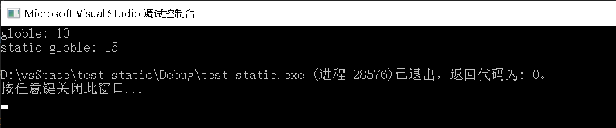
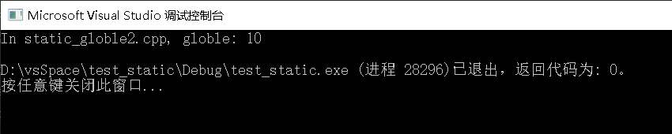
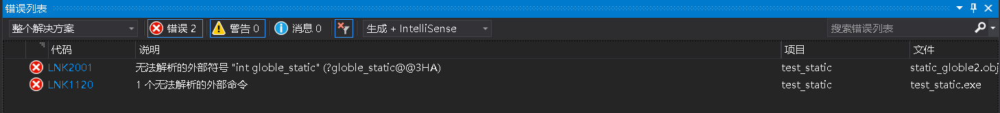
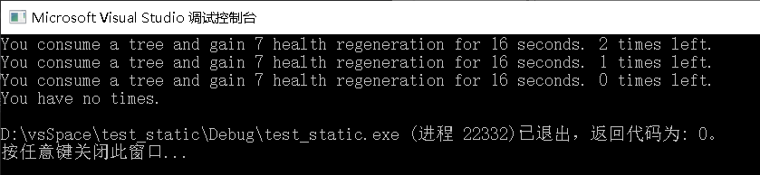
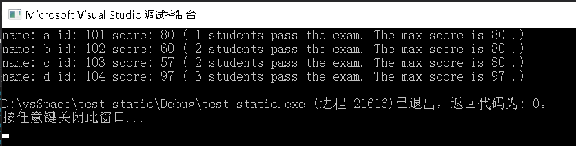

## 问题描述

**查阅相关资料,写实验程序,**

**理解下面概念的区别:**

**静态变量**

**静态全局变量**

**静态局部变量**

**静态成员变量**

**全局变量**


## 问题解答

1.  存储方式：

    静态变量和全局变量都是静态存储的，在存储方式上并无区别。

2.  作用域及生存周期：

    全局变量具有全局作用域。全局变量只需在一个源文件中定义，就可以作用于所有的源文件。当然，其他不包含全局变量定义的源文件需要用extern 关键字再次声明这个全局变量。

    局部变量也只有局部作用域，它是自动对象（auto），它在程序运行期间不是一直存在，而是只在函数执行期间存在，函数的一次调用执行结束后，变量被撤销，其所占用的内存也被收回。

    静态局部变量具有局部作用域，它只被初始化一次，自从第一次被初始化直到程序运行结束都一直存在，它和全局变量的区别在于全局变量对所有的函数都是可见的，而静态局部变量只对定义自己的函数体始终可见。

    静态全局变量也具有全局作用域，它与全局变量的区别在于如果程序包含多个文件的话，它作用于定义它的文件里，不能作用到其它文件里，即被static关键字修饰过的变量具有文件作用域。这样即使两个不同的源文件都定义了相同名字的静态全局变量，它们也是不同的变量。


​	把局部变量改变为静态变量后是改变了它的存储方式即改变了它的生存期。把全局变量改变为静态变量后是改变了它的作用域，限制了它的使用范围。

3.  分配内存空间：

    全局变量，静态局部变量，静态全局变量都在静态存储区分配空间，而局部变量在栈里分配空间。

## 实验论证

#### 实验一 全局变量与静态全局变量

静态全局变量不可被其他文件使用

代码分为两部分static_globle1.cpp和static_globle2.cpp

运行static_globle1.cpp结果：



图中可以看到全局变量值为10，静态全局变量值为15。

将static_globle1.cpp中的main()函数注释掉，运行如下代码

```c++
int main()
{
	extern int globle;
	cout << "globle: " << globle << endl;	
	return 0;
}
```

得到如下结果：



运行如下代码：

```c++
int main()
{
	extern int globle_static;
	cout << "In static_globle2.cpp, globle_static: " << globle_static << endl;
	return 0;
}
```

得到以下错误：



故得出结论：把全局变量改变为静态变量后是改变了它的作用域，限制了它的使用范围。使其只能在其所定义的文件中使用。

### 实验二 静态局部变量作用

情景：通过静态局部变量来控制一个只能使用3次的道具（dota吃树）。

代码见static_local.cpp

运行结果如下：



### 实验三 静态成员变量作用

情景：通过student类的一个静态成员变量统计考试及格的学生数量以及考试的最高分。

代码见static_member.cpp

运行结果如下：



## 语义信息

静态（static）使变量的生存周期变成了整个源程序。

全局/局部则规定了变量的作用域。

## 参考链接

https://blog.csdn.net/ZDT_zdh/article/details/90059753

https://blog.csdn.net/hi_baymax/article/details/82425457

https://blog.csdn.net/qq_22238021/article/details/79533711

https://blog.csdn.net/hi_baymax/article/details/82425457

https://www.cnblogs.com/yujianfei/p/8974813.html